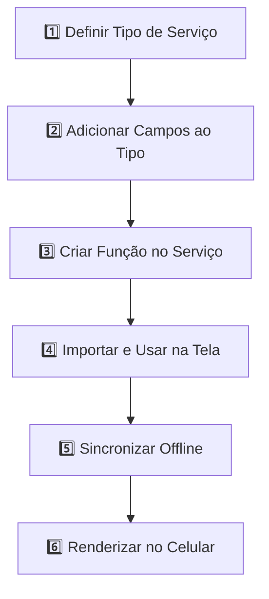

# 🚀 Guia Completo: Criando um Novo Serviço no Mobile

## Exemplo Prático: Criando um Serviço "Teste"

Este guia detalha o fluxo **passo a passo** desde a criação até renderizar o serviço na tela do celular.

---

## 📋 Fluxo Geral



---

## **PASSO 1️⃣: Definir o Tipo de Serviço**

### Arquivo: [`mobile/types/servico.ts`](mobile/types/servico.ts)

Adicione o novo tipo à lista de `TipoServico`:

```typescript
export type TipoServico =
  | 'APR'
  | 'Abertura e Fechamento de Chave'
  | 'Teste'  // ✅ NOVO
  | 'Transformador'
  // ... outros tipos
```

### Define as categorias de fotos para o novo tipo

```typescript
export const SERVICO_PHOTO_MAP: Record<TipoServico, Array<{ field: keyof Servico; label: string }>> = {
  // ... outros tipos
  'Teste': [
    { field: 'fotos_teste_observacao', label: 'Foto de Observação' },
    { field: 'fotos_teste_comprovacao', label: 'Foto de Comprovação' },
  ],
}
```

---

## **PASSO 2️⃣: Adicionar Campos Foto ao Interface Servico**

### Arquivo: [`mobile/types/servico.ts`](mobile/types/servico.ts)

Adicione os campos de foto à interface `Servico`:

```typescript
export interface Servico {
  // ... campos existentes (id, obra_id, tipo_servico, status, etc)
  
  // Fotos genéricas
  fotos_antes: FotoInfo[];
  fotos_durante: FotoInfo[];
  fotos_depois: FotoInfo[];

  // ✅ NOVO - Fotos específicas do serviço Teste
  fotos_teste_observacao?: FotoInfo[];
  fotos_teste_comprovacao?: FotoInfo[];
  
  // ... resto dos campos
}
```

### Faça o mesmo para `ServicoLocal`:

```typescript
export interface ServicoLocal {
  // ... campos existentes
  
  // ✅ NOVO - Fotos armazenadas como photoIds
  fotos_teste_observacao?: string[];
  fotos_teste_comprovacao?: string[];
  
  // ... resto dos campos
}
```

---

## **PASSO 3️⃣: Criar Funções no Serviço**

### Arquivo: [`mobile/lib/servico-sync.ts`](mobile/lib/servico-sync.ts)

#### 3.1 - Criar um Serviço Novo (Rascunho)

```typescript
/**
 * Cria um novo serviço do tipo Teste
 * Armazenado localmente com status 'rascunho'
 */
export const createTesteServico = async (obraId: string): Promise<Servico> => {
  const now = new Date().toISOString();
  const servicoId = `temp_teste_${Date.now()}`;
  
  const novoServico: ServicoLocal = {
    id: servicoId,
    obra_id: obraId,
    tipo_servico: 'Teste',
    status: 'rascunho',
    sync_status: 'offline',
    created_at: now,
    updated_at: now,
    fotos_antes: [],
    fotos_durante: [],
    fotos_depois: [],
    fotos_teste_observacao: [],
    fotos_teste_comprovacao: [],
  };

  // Armazena localmente
  const pendingServicos = await AsyncStorage.getItem(PENDING_SERVICOS_KEY);
  const list = pendingServicos ? JSON.parse(pendingServicos) : [];
  list.push(novoServico);
  
  await AsyncStorage.setItem(PENDING_SERVICOS_KEY, JSON.stringify(list));
  
  return novoServico as Servico;
};
```

#### 3.2 - Buscar Serviços de uma Obra

```typescript
/**
 * Busca todos os serviços de uma obra
 * Combina dados online + offline
 */
export const fetchServicosForObra = async (obraId: string): Promise<Servico[]> => {
  try {
    // 1. Busca online no Supabase
    const { data: onlineServicos } = await supabase
      .from('servicos')
      .select('*')
      .eq('obra_id', obraId)
      .order('created_at', { ascending: false });

    // 2. Busca offline no AsyncStorage
    const pendingStr = await AsyncStorage.getItem(PENDING_SERVICOS_KEY);
    const offlineServicos: ServicoLocal[] = pendingStr ? JSON.parse(pendingStr) : [];
    
    // 3. Combina (online tem prioridade)
    const onlineIds = new Set((onlineServicos || []).map(s => s.id));
    const combined = [
      ...(onlineServicos || []),
      ...offlineServicos.filter(s => !onlineIds.has(s.id))
    ];

    return combined as Servico[];
  } catch (error) {
    captureError(error, 'fetchServicosForObra');
    return [];
  }
};
```

#### 3.3 - Salvar Serviço Localmente

```typescript
/**
 * Salva alterações no serviço (offline)
 * Inclui adição de fotos
 */
export const saveServicoLocal = async (servico: ServicoLocal): Promise<void> => {
  const pendingStr = await AsyncStorage.getItem(PENDING_SERVICOS_KEY);
  const list: ServicoLocal[] = pendingStr ? JSON.parse(pendingStr) : [];
  
  // Encontra e atualiza ou insere novo
  const index = list.findIndex(s => s.id === servico.id);
  if (index >= 0) {
    list[index] = { ...list[index], ...servico, updated_at: new Date().toISOString() };
  } else {
    list.push(servico);
  }
  
  await AsyncStorage.setItem(PENDING_SERVICOS_KEY, JSON.stringify(list));
};
```

#### 3.4 - Adicionar Foto ao Serviço

```typescript
/**
 * Adiciona uma foto a um campo específico do serviço
 * A foto é primeiro armazenada em photo-backup, depois adicionada ao serviço
 */
export const appendPhotoToServicoLocal = async (
  servico: ServicoLocal,
  fieldKey: keyof Servico,
  photoId: string,
): Promise<ServicoLocal> => {
  const campo = (servico as any)[fieldKey];
  
  if (!Array.isArray(campo)) {
    (servico as any)[fieldKey] = [photoId];
  } else if (!campo.includes(photoId)) {
    campo.push(photoId);
  }
  
  servico.updated_at = new Date().toISOString();
  servico.sync_status = 'offline';
  
  await saveServicoLocal(servico);
  return servico;
};
```

#### 3.5 - Sincronizar com Backend

```typescript
/**
 * Sincroniza todos os serviços pendentes com o Supabase
 * Transforma IDs temporários em UUIDs permanentes
 */
export const syncAllPendingServicos = async (): Promise<void> => {
  if (syncAllPendingServicosInProgress) return;
  syncAllPendingServicosInProgress = true;

  try {
    const { isConnected } = await NetInfo.fetch();
    if (!isConnected) return;

    const pendingStr = await AsyncStorage.getItem(PENDING_SERVICOS_KEY);
    const pendingServicos: ServicoLocal[] = pendingStr ? JSON.parse(pendingStr) : [];

    for (const servico of pendingServicos) {
      await syncServico(servico);
    }
  } finally {
    syncAllPendingServicosInProgress = false;
  }
};

async function syncServico(servico: ServicoLocal): Promise<void> {
  // Resolve fotos locais para URLs antes de enviar
  const servicoComFotos = await resolveLocalPhotosToUrls(servico);
  
  // Insere ou atualiza no Supabase
  const { data, error } = await supabase
    .from('servicos')
    .upsert([servicoComFotos], { onConflict: 'id' })
    .select();

  if (error) {
    servico.sync_status = 'error';
    servico.error_message = error.message;
  } else {
    servico.sync_status = 'synced';
    servico.error_message = null;
  }

  await saveServicoLocal(servico);
}
```

---

## **PASSO 4️⃣: Usar o Serviço em Uma Tela**

### Arquivo: [`mobile/app/servico-detalhe.tsx`](mobile/app/servico-detalhe.tsx)

#### 4.1 - Importar as funções

```typescript
import { 
  fetchServicosForObra, 
  createTesteServico,
  appendPhotoToServicoLocal, 
  saveServicoLocal,
  syncAllPendingServicos 
} from '../lib/servico-sync';
import { backupPhoto } from '../lib/photo-backup';
```

#### 4.2 - Carregar Serviços ao Abrir a Tela

```typescript
export default function ServicoDetalhePage() {
  const router = useRouter();
  const params = useLocalSearchParams<{ obraId?: string }>();
  
  const [servicos, setServicos] = useState<Servico[]>([]);
  const [loading, setLoading] = useState(true);
  
  // Carrega serviços quando a tela é aberta
  useEffect(() => {
    const loadServicos = async () => {
      setLoading(true);
      const lista = await fetchServicosForObra(params.obraId || '');
      setServicos(lista);
      setLoading(false);
    };
    loadServicos();
  }, [params.obraId]);
```

#### 4.3 - Criar Novo Serviço Teste

```typescript
const handleCreateTesteServico = async () => {
  const novoServico = await createTesteServico(params.obraId || '');
  setServicos([...servicos, novoServico]);
  router.push({
    pathname: '/servico-detalhe',
    params: { 
      data: encodeURIComponent(JSON.stringify(novoServico))
    }
  });
};
```

#### 4.4 - Adicionar Foto ao Serviço

```typescript
const handleTirarFoto = async (fieldKey: keyof Servico) => {
  // 1. Abre câmera
  const result = await ImagePicker.launchCameraAsync({
    aspect: [4, 3],
    quality: 0.8,
  });

  if (result.canceled) return;

  const uri = result.assets[0].uri;
  
  // 2. Faz backup da foto com metadados
  const photoId = await backupPhoto({
    uri,
    latitude: location?.coords.latitude,
    longitude: location?.coords.longitude,
    timestamp: Date.now(),
    takenAt: new Date().toISOString(),
  });

  // 3. Adiciona ao serviço
  const servicoAtualizado = await appendPhotoToServicoLocal(
    servico,
    fieldKey,
    photoId
  );
  
  setServico(servicoAtualizado);
};
```

---

## **PASSO 5️⃣: Sincronizar Offline**

### Arquivo: [`mobile/app/_layout.tsx`](mobile/app/_layout.tsx) ou [`mobile/contexts/AuthContext.tsx`](mobile/contexts/AuthContext.tsx)

Adicione sincronização automática quando a conexão volta:

```typescript
import NetInfo from '@react-native-community/netinfo';
import { syncAllPendingServicos } from '../lib/servico-sync';

export function RootLayout() {
  // Sincroniza quando volta online
  useEffect(() => {
    const unsubscribe = NetInfo.addEventListener(state => {
      if (state.isConnected && !state.isInternetReachable === false) {
        syncAllPendingServicos().catch(err => captureError(err, 'syncOnConnect'));
      }
    });
    
    return () => unsubscribe();
  }, []);
  
  return (
    <AuthProvider>
      {/* seu layout */}
    </AuthProvider>
  );
}
```

---

## **PASSO 6️⃣: Renderizar na Tela**

### Arquivo: [`mobile/app/servico-detalhe.tsx`](mobile/app/servico-detalhe.tsx)

#### 6.1 - Exibir Lista de Serviços

```typescript
export default function ServicoDetalhePage() {
  // ... código anterior
  
  if (loading) return <ActivityIndicator />;

  return (
    <ScrollView>
      <Text style={styles.title}>Serviços</Text>
      
      {servicos.map(servico => (
        <TouchableOpacity 
          key={servico.id}
          onPress={() => handleSelectServico(servico)}
          style={styles.servicoCard}
        >
          <Text style={styles.servicoTitle}>{servico.tipo_servico}</Text>
          <Text style={styles.servicoStatus}>{servico.status}</Text>
        </TouchableOpacity>
      ))}
      
      <TouchableOpacity 
        onPress={handleCreateTesteServico}
        style={styles.createButton}
      >
        <Text>+ Novo Serviço Teste</Text>
      </TouchableOpacity>
    </ScrollView>
  );
}
```

#### 6.2 - Exibir Detalhes do Serviço

```typescript
function ServicoDetalhes({ servico }: { servico: Servico }) {
  const [fotos, setFotos] = useState<FotoInfo[]>(servico.fotos_teste_observacao || []);

  return (
    <View style={styles.container}>
      <Text style={styles.title}>
        {servico.tipo_servico} - {servico.status}
      </Text>

      {/* Exibir Fotos */}
      <Text style={styles.sectionTitle}>Fotos de Observação</Text>
      <ScrollView horizontal>
        {fotos.map((foto, idx) => (
          <Image 
            key={idx}
            source={{ uri: foto.url || foto.uri }}
            style={{ width: 100, height: 100, margin: 5 }}
          />
        ))}
      </ScrollView>

      {/* Botão para Adicionar Foto */}
      <TouchableOpacity 
        onPress={() => handleTirarFoto('fotos_teste_observacao')}
        style={styles.button}
      >
        <Text>📷 Tirar Foto - Observação</Text>
      </TouchableOpacity>

      <TouchableOpacity 
        onPress={() => handleTirarFoto('fotos_teste_comprovacao')}
        style={styles.button}
      >
        <Text>📷 Tirar Foto - Comprovação</Text>
      </TouchableOpacity>

      {/* Sincronizar */}
      <TouchableOpacity 
        onPress={syncAllPendingServicos}
        style={styles.syncButton}
      >
        <Text>🔄 Sincronizar</Text>
      </TouchableOpacity>
    </View>
  );
}
```

---

## 🎯 Resumo do Fluxo Completo

| Etapa | Arquivo | Ação |
|-------|---------|------|
| 1️⃣ Tipo | `servico.ts` | Adicionar `'Teste'` a `TipoServico` |
| 2️⃣ Campos | `servico.ts` | Adicionar `fotos_teste_*` a `Servico` |
| 3️⃣ Funções | `servico-sync.ts` | Criar `createTesteServico()` e funções CRUD |
| 4️⃣ Tela | `servico-detalhe.tsx` | Importar e usar funções |
| 5️⃣ Sincronizar | `_layout.tsx` | Chamar `syncAllPendingServicos()` |
| 6️⃣ Renderizar | `servico-detalhe.tsx` | Exibir fotos e botões |

---

## 💾 Armazenamento de Dados

```
AsyncStorage (Mobile)
├─ @servicos_pending_sync → Array<ServicoLocal>
├─ @servicos_local → Object (cache local)
└─ @photo_* → Metadados de fotos

   ↓ (quando online)

Supabase (Backend)
├─ servicos table
│  ├─ id (UUID após sync)
│  ├─ obra_id
│  ├─ tipo_servico: 'Teste'
│  ├─ status: 'rascunho' | 'em_progresso' | 'completo'
│  └─ fotos_teste_observacao[] → storage/obras/{obraId}/{photoId}
└─ servicos_fotos table → Metadados das fotos
```

---

## 🔄 Ciclo de Vida Completo

1. **Criação**: `createTesteServico()` → Rascunho local
2. **Edição**: `appendPhotoToServicoLocal()` → Atualizado local
3. **Sincronização**: `syncAllPendingServicos()` → Quando online
4. **Exibição**: `fetchServicosForObra()` → Mostra online + offline
5. **Persistência**: AsyncStorage → Nunca perde dados

---

## ✅ Checklist para Novo Serviço

- [ ] Adicionar tipo em `types/servico.ts` (TipoServico)
- [ ] Adicionar campos em `Servico` interface
- [ ] Adicionar campos em `ServicoLocal` interface
- [ ] Adicionar mapeamento em `SERVICO_PHOTO_MAP`
- [ ] Criar funções em `servico-sync.ts`
- [ ] Importar e usar em tela desejada
- [ ] Testar adição de fotos
- [ ] Testar sincronização offline
- [ ] Validar renderização de fotos

---

## 🚨 Erros Comuns

### ❌ Erro: "Campo não encontrado no AsyncStorage"
- Certifique-se de adicionar o campo em ambos `Servico` e `ServicoLocal`

### ❌ Erro: "Fotos não sincronizam"
- Verifique se `syncAllPendingServicos()` está sendo chamada
- Confirme que a rede está conectada com `NetInfo`

### ❌ Erro: "Foto não aparece na tela"
- Garanta que `photo-backup.ts` salvou corretamente
- Verifique se a URL é válida com `photoId` correto

